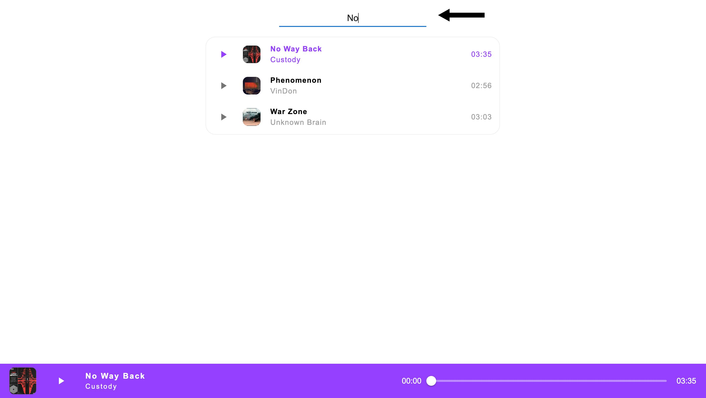
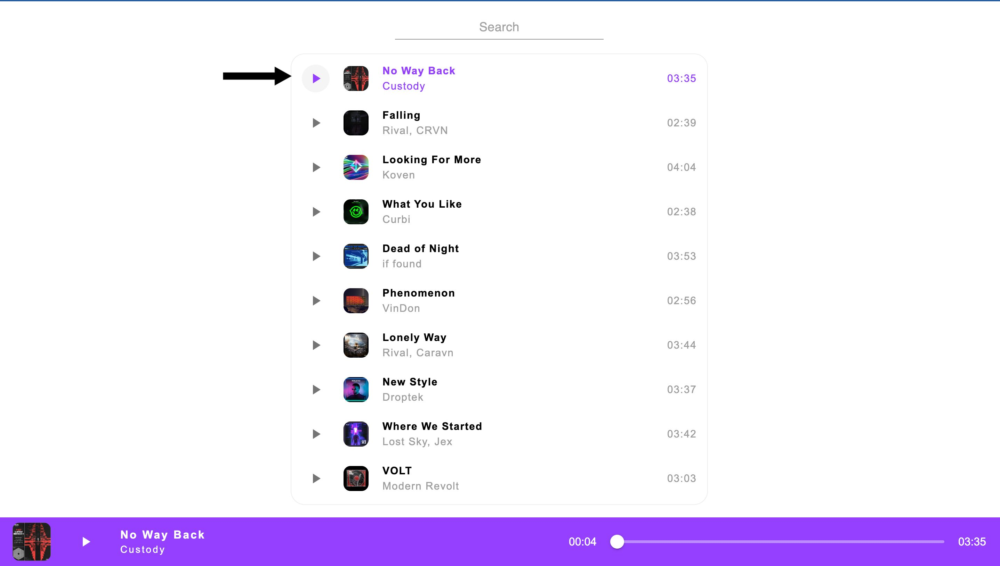
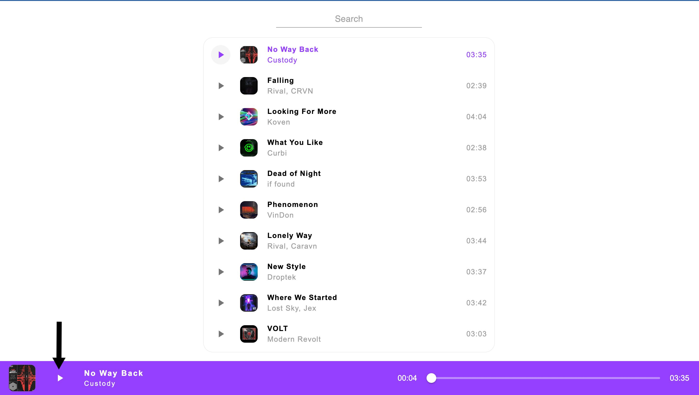
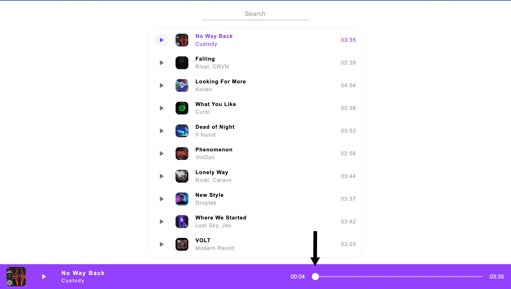

<h1 align="center">Welcome to MusicApp 👋</h1>
<p>
  <a href="https://www.npmjs.com/package/musicapp" target="_blank">
    
  </a>
  <a href="https://github.com/raman-davidovich/MusicApp" target="_blank">
    
  </a>
</p>

> A simple React application for listening to music with search and rewind functions.

### 🏠 [Homepage](https://bestreactmusicapp.netlify.app/)

### ✨ [Demo](https://bestreactmusicapp.netlify.app/)


## Install

```sh
npm install
```

## Usage

```sh
npm run dev
```

> Use "Search" field for searching among titles, artists and track names.



> Use "Play"/"Pause" button for playing control.

> 

> You can also use "Play"/"Pause" button in a playbar.



> Use a slider for tracking or changing current song time playing status.



## Author

👤 **Raman Davidovich**

- Website: https://mysideprojects.tech/
- Twitter: [@RoDavidovich](https://twitter.com/RoDavidovich)
- Github: [@raman-davidovich](https://github.com/raman-davidovich)
- LinkedIn: [@raman-davidovich](https://linkedin.com/in/raman-davidovich)

## Show your support

Give a ⭐️ if this project helped you!

---

_This README was generated with ❤️ by [readme-md-generator](https://github.com/kefranabg/readme-md-generator)_
